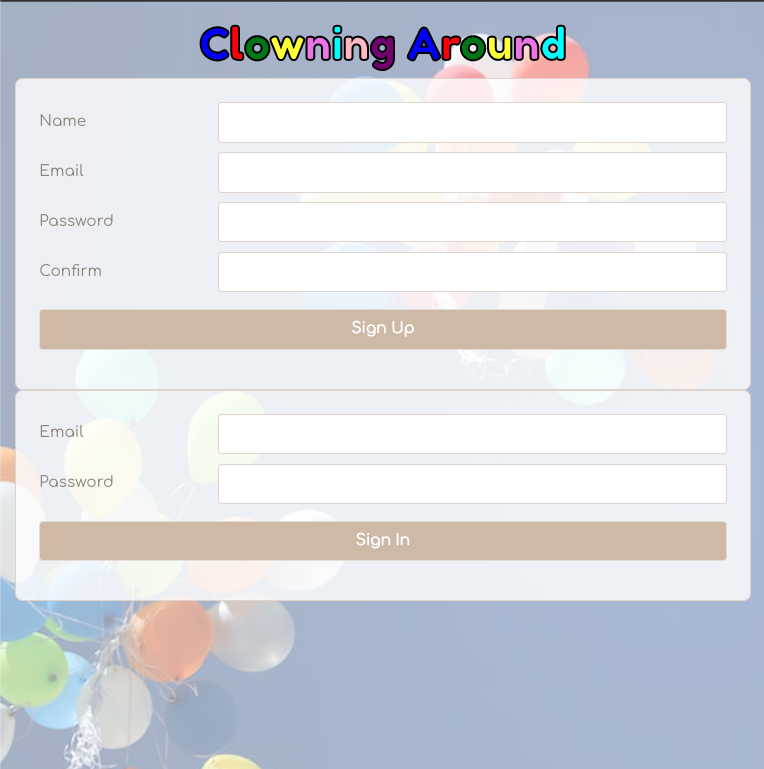

Project 3 - Clowning Around
==============================

This is the README documentation for Slow to React's project 3.  
We saw a desperate need for the clown community to get together and share knowledge without prejudice. Thus Clowning Around was born. So please stop by and hang out. You might just learn a new joke. [This](https://clowning-around-client.onrender.com/) is the best place to Clown Around. 

1. Screenshots
2. MVP User Stories
3. Pitch Deck 
4. Trello Board
5. Wireframes
6. ERD Breakdown 
7. Next Versions 

ScreenShots
---------------

MVP User Stories
----------------

- [x] As a user I want to be able to make an account
- [x] As a user I want to be able to log in
- [x] As a user I want to be able to log out
- [x] As a user I want to be able to view posts
- [x] As a user I want to be able to like or dislike a post
- [x] As a user I want to be able to comment on a post
- [x] As a user I want to see all comments on a post
- [x] As a user I want to be able to create a post
- [x] As a user I want to be able to delete my own post
- [x] As a user I want to be able to update my own post
- [x] As a user I want to be able to delete my own comments

Pitch Deck
---------------------
[Here](https://docs.google.com/presentation/d/10eaTwo8Q6Potm98l5VEC-mSVM3T2HwRvdJ4ipaLdRDQ/edit#slide=id.p) is how we pitched our application to the big wigs over at CLOWNCO. 

Trello Board
----------------------

Check out our Trello Board describing the problems we hope to solve with our application [here](https://trello.com/invite/b/ytAofYvc/ATTI90ed1247b0b2349b4ef3d74a64cc27d56A731FBF/project-3). 

Wireframes
-----------------

ERD Breakdown 
---------------------

Next Versions
-------------

Version 2 
- [] As a user I want to be able to update my own comments
- [] As a user I want to be able to upload a profile picture
- [] As a user I want to be able to search posts by tags
- [] As a user I want to be able to add pictures to my post
- [] As a user I want to be able to delete my account

Version 3

- [] As a user I want to be able to change my password
- [] As a user I want admins to be able to manage posts and comments
- [] As a user I want to change between dark and light theme